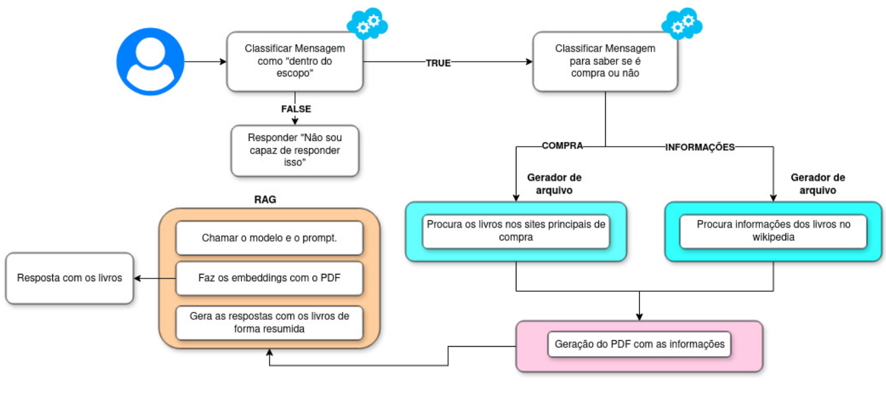
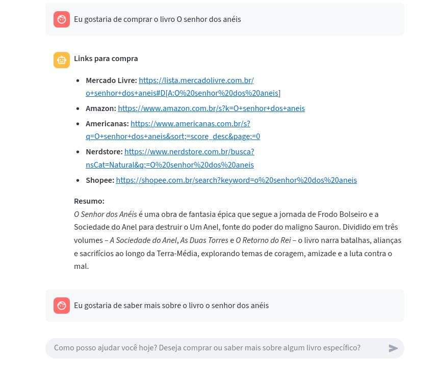

# Projeto-final-Fastcamp-LAMIA

Durante o desenvolvimento deste projeto, percebi que modelos como o llama-3.3-70b-versatile e o openai/gpt-oss-120b apresentavam sérios problemas na geração de links para aquisição de livros, muitas vezes fornecendo resultados inválidos, sites inexistentes ou pouco confiáveis, além de não oferecerem variedade de opções. Diante disso, enxerguei uma oportunidade de aplicar, na prática, os conhecimentos que adquiri no Fast Camp de LLM promovido pelo LAMIA. Assim, decidi criar um agente bibliotecário baseado em LLM, capaz de buscar links válidos de compra e, ao mesmo tempo, entregar informações relevantes sobre a obra solicitada. Para aumentar a precisão das respostas, utilizei filtros de classificação apoiados em embeddings da biblioteca SpaCy, e complementei a solução com técnicas de prompt engineering, como o Few-Shot, que ajudaram a orientar o modelo na forma correta de responder às diferentes solicitações dos usuários.

## Estrutura de pastas resumida

```bash
project-root/
│
├── src/
│   ├── embeddings_aux/   # Arquivos txt com exemplos de queries
│   ├── router/           # Código de classificação
│   ├── summarizer/       # Código da sumarização e RAG
│   ├── prompts/          # Arquivos txt contendo prompts
│   ├── utils/            # Funções auxiliares  
│
├── agent.py              # Agente
└── app.py                # Tela do Front-end com o streamlit
```
## Diagrama do Projeto


## Funcionalidades do Projeto

1. Classificação de entrada de usuário: O modelo verifica por meio de similaridade de embeddings que tipo de entrada é aquela. Se é:
  - Dentro do escopo de livros
    - Compra de um livro
    - Pedido por informação de um livro  
  - Fora do escopo de livros 
2. Roteamento de mensagens: Com base na classificação, o modelo vai responder de uma determinada forma com auxilio de prompts.
3. Salvamento e utilização de arquivos PDF: O projeto utiliza PDFs para salvar as informações que o modelo coletar e também utiliza o mesmo PDF para gerar resumos.
4. Sumarização de informações: O modelo do projeto resume informações presentes em um arquivo PDF e passar para outro arquivo PDF.
5. Carregamento arquivos txt: O projeto utiliza arquivos txt para carregamento de prompt e para carregamento de frases para dar auxilio ao código de similaridade.
6. Suporte do Streamlit para criação de um front-end: o projeto disponibiliza um front-end para interação com o usuário. 


## Requisitos do projeto

- dotenv
- streamlit
- langgraph
- langchain-community
- langgraph
- reportlab
- pymupdf
- spacy
- langchain-Groq

Para instalar todas essas dependencias basta instalar pelo arquivo "requirements.txt"
```bash
pip install -r requirements.txt
```
## Como usar
1. Clone o reposítório do projeto e entre na pasta.
2. Na pasta raiz rode o comando no terminal.
   ```bash
   streamlit run app.py
   ```
  Depois de rodar ese comando, uma aba vai abrir no seu navegador mostrando a interface do chatbot.

3. Pergunte sobre algum livro ou compre
   


## Acesse o relatório detalhado
No repositório do projeto você pode acessar ao PDF do relatório e ter mais informações 

